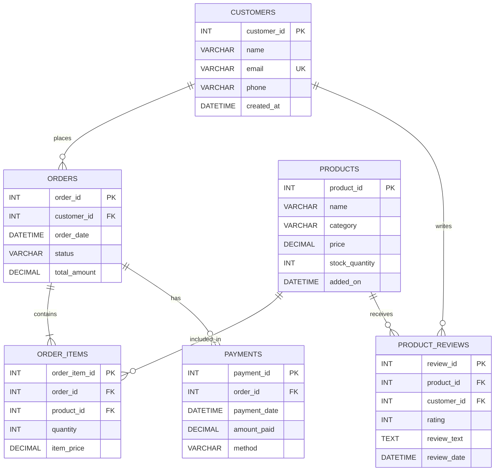

# Online Store ERD

```mermaid
erDiagram
    CUSTOMERS ||--o{ ORDERS : places
    ORDERS ||--|{ ORDER_ITEMS : contains
    PRODUCTS ||--o{ ORDER_ITEMS : included_in
    ORDERS ||--o{ PAYMENTS : has
    CUSTOMERS ||--o{ PRODUCT_REVIEWS : writes
    PRODUCTS ||--o{ PRODUCT_REVIEWS : receives

    CUSTOMERS {
        INT customer_id PK
        VARCHAR name
        VARCHAR email UK
        VARCHAR phone
        DATETIME created_at
    }

    PRODUCTS {
        INT product_id PK
        VARCHAR name
        VARCHAR category
        DECIMAL price
        INT stock_quantity
        DATETIME added_on
    }

    ORDERS {
        INT order_id PK
        INT customer_id FK
        DATETIME order_date
        VARCHAR status
        DECIMAL total_amount
    }

    ORDER_ITEMS {
        INT order_item_id PK
        INT order_id FK
        INT product_id FK
        INT quantity
        DECIMAL item_price
    }

    PAYMENTS {
        INT payment_id PK
        INT order_id FK
        DATETIME payment_date
        DECIMAL amount_paid
        VARCHAR method
    }

    PRODUCT_REVIEWS {
        INT review_id PK
        INT product_id FK
        INT customer_id FK
        INT rating
        TEXT review_text
        DATETIME review_date
    }
```
